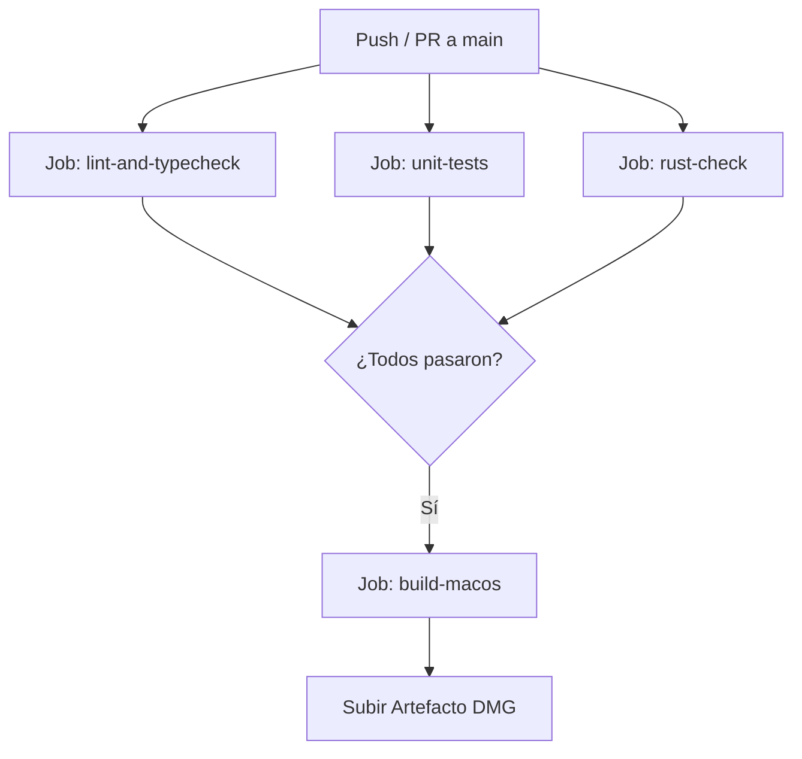

# Manual Técnico: Pipeline de CI/CD (GitHub Actions)

Este documento describe la arquitectura y funcionamiento del pipeline de Integración y Entrega Continua (CI/CD) de Glosa, configurado mediante GitHub Actions.

---

## 1. Objetivo del Pipeline

El flujo automatizado tiene tres propósitos fundamentales:
1. **Garantizar la calidad del código**: Ejecutar linters (Oxlint + ESLint), verificación estática de tipos (Vue TSC) y formato de código antes de cualquier despliegue o integración.
2. **Prevenir regresiones funcionales**: Correr la suite de pruebas unitarias automatizadas (Vitest) en cada cambio.
3. **Generar artefactos ejecutables**: Compilar y empaquetar la aplicación de escritorio Tauri para macOS, generando el instalador `.dmg` y almacenándolo en los artefactos descargables de GitHub Actions.

---

## 2. Disparadores (Triggers)

El pipeline se encuentra definido en [`.github/workflows/ci.yml`](file:///Users/mau/Repos/bendito-codigo/internal/libreta-abierta/frontend/.github/workflows/ci.yml) y se activa ante los siguientes eventos:

- **Push a la rama `main`**: Compila y genera el instalador DMG ante cada cambio integrado a producción.
- **Pull Requests hacia `main`**: Ejecuta las validaciones de calidad, tests y empaquetado para verificar que el PR sea seguro de integrar.
- **`workflow_dispatch`**: Permite la ejecución manual bajo demanda desde la pestaña *Actions* en la interfaz web de GitHub.

Adicionalmente, se incluye una política de concurrencia (`cancel-in-progress: true`) para cancelar automáticamente ejecuciones previas si se envía un nuevo commit a la misma rama, optimizando el uso de recursos y minutos de cómputo.

---

## 3. Estructura de Jobs



### Job 1: `lint-and-typecheck` (Frontend)
- **Entorno**: `ubuntu-latest`
- **Pasos**:
  1. Descarga del código (`actions/checkout@v4`).
  2. Configuración de Node.js 22 con caché de `npm` (`actions/setup-node@v4`).
  3. Instalación de dependencias limpias (`npm ci`).
  4. Ejecución de linters (`npm run lint`): corre Oxlint y ESLint.
  5. Verificación de tipos TypeScript en componentes y composables (`npm run type-check`).

### Job 2: `unit-tests` (Pruebas Unitarias)
- **Entorno**: `ubuntu-latest`
- **Pasos**:
  1. Descarga del código e instalación de dependencias con Node.js 22.
  2. Ejecución de la suite completa de tests (`npm test` con Vitest en modo `run`).

### Job 3: `rust-check` (Código Nativo Rust)
- **Entorno**: `macos-latest`
- **Pasos**:
  1. Instalación del toolchain de Rust estable con `clippy` y `rustfmt`.
  2. Caché de dependencias y binarios de Cargo (`swatinem/rust-cache@v2`).
  3. Validación de formato de código Rust (`cargo fmt --check` en `src-tauri`).
  4. Análisis estático de código Rust (`cargo clippy -- -D warnings` en `src-tauri`).

### Job 4: `build-macos` (Generación de Artefacto DMG)
- **Entorno**: `macos-latest` (Apple Silicon)
- **Dependencia**: Solo se ejecuta si los tres jobs anteriores (`lint-and-typecheck`, `unit-tests`, `rust-check`) concluyen satisfactoriamente.
- **Firma Ad-hoc y Sellado de Recursos**:
  - Se configuró `"signingIdentity": "-"` en [`src-tauri/tauri.conf.json`](file:///Users/mau/Repos/bendito-codigo/internal/libreta-abierta/frontend/src-tauri/tauri.conf.json).
  - Esto garantiza que Tauri aplique la firma Ad-Hoc sellando el bundle `Glosa.app`, `Info.plist` y sus recursos, evitando que macOS Gatekeeper lo detecte como un paquete dañado o con firma rota al descargarse desde internet.
- **Pasos**:
  1. Configuración de Node.js y Rust toolchain.
  2. Restauración de caché de Cargo.
  3. Ejecución de `npm run tauri:build`:
     - Compila el frontend estático optimizado con Vite.
     - Compila el backend de Rust en perfil release (`--release`).
     - Firma ad-hoc y sella el bundle `.app`.
     - Empaqueta el instalador (`Glosa_x.x.x_aarch64.dmg`).
  4. Subida del instalador `.dmg` a los artefactos de la ejecución en GitHub mediante `actions/upload-artifact@v4` con retención de 14 días.

---

## 4. Cómo Descargar el Instalador DMG Generado

1. Dirígete a la pestaña **Actions** en el repositorio de GitHub.
2. Selecciona la ejecución del workflow deseada correspondiente a tu commit en `main`.
3. Al pie de la página, en la sección **Artifacts**, encontrarás el archivo **`glosa-macos-dmg`**.
4. Haz clic sobre él para descargar el archivo zip que contiene el `.dmg` listo para instalar.

---

## 5. Mantenimiento y Comandos Locales

Para asegurar que los cambios pasen el pipeline antes de hacer push:

```bash
# 1. Ejecutar linters frontend
npm run lint

# 2. Validar tipos de TypeScript
npm run type-check

# 3. Correr pruebas unitarias
npm test

# 4. Formatear y validar código Rust
cd src-tauri
cargo fmt --check
cargo clippy -- -D warnings
cd ..

# 5. Probar build local completo
npm run tauri:build
```
